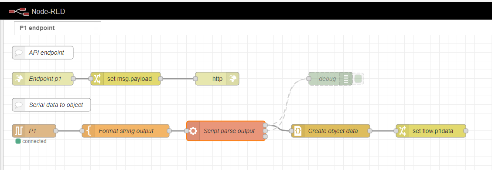

# Node red flow
Node red API endpoint implementation of P1 / power meter

## Flow
Collects data from serial port every 10 seconds and fomrats and parses data to a json object.
The json object is return by endpont 'P1'

